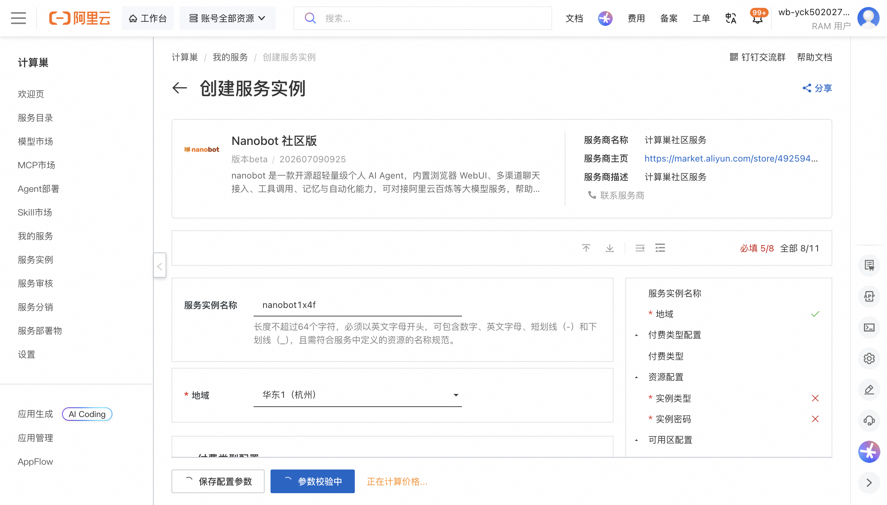
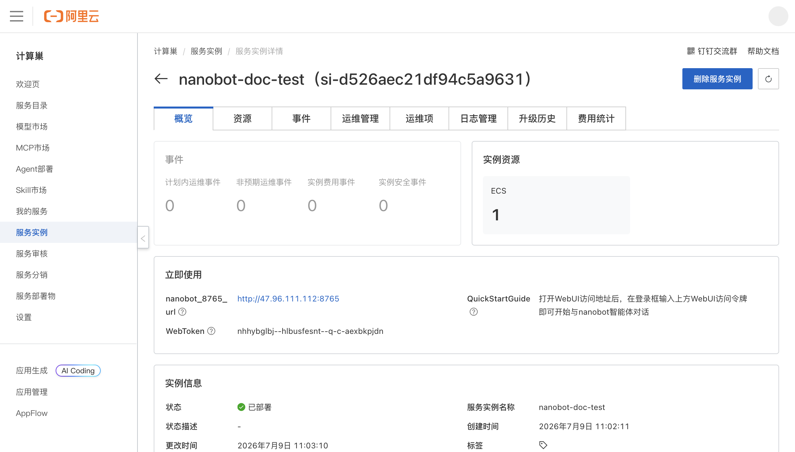
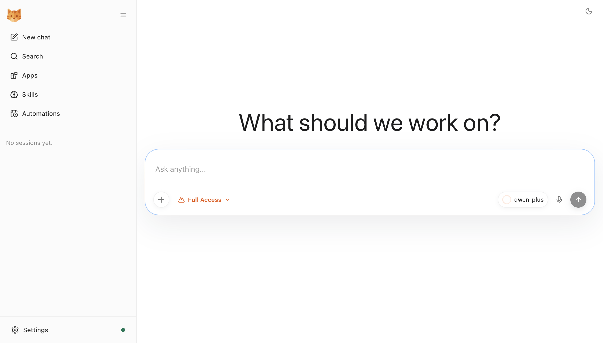

# Nanobot 社区版 部署文档

## 概述

Nanobot 社区版 是一款开源超轻量级个人 AI Agent，内置浏览器 WebUI、多渠道聊天接入、工具调用、记忆与自动化能力，可对接阿里云百炼等大模型服务，帮助用户快速拥有可自主部署与管理的专属智能体。

通过阿里云计算巢服务，您可以快速部署 Nanobot 社区版，实现开箱即用。

## 部署流程

### 1. 创建服务实例

访问 Nanobot 社区版 服务部署链接，按提示填写部署参数：

[部署链接](https://computenest.console.aliyun.com/service/instance/create/cn-hangzhou?type=user&ServiceId=service-5b0c819e169946219cd6)

主要参数说明：

| 参数 | 说明 |
|------|------|
| 服务实例名称 | 自定义实例名称，如 `nanobot-doc-test` |
| 地域 | 选择部署地域，如华东 1（杭州） |
| 付费类型 | 按量付费（PostPaid）或包年包月 |
| 实例类型 | 建议选择 2 vCPU / 8 GiB 及以上规格，如 `ecs.u1-c1m4.large` |
| 实例密码 | ECS 登录密码，需包含大小写字母、数字及特殊符号 |
| 可用区配置 | 选择已有 VPC 或新建 VPC |
| 阿里云百炼 API Key | 用于调用大模型，获取地址：https://dashscope.console.aliyun.com |
| 百炼模型名称 | 如 `qwen-plus`、`qwen-max`、`qwen-turbo` |

### 2. 确认订单并创建

参数填写完成后可以看到对应询价明细，确认参数后点击 **下一步：确认订单**。确认订单完成后同意服务协议并点击 **立即创建** 进入部署阶段。

### 3. 等待部署完成

等待部署完成后进入服务实例管理，在控制台找到 Nanobot 社区版 访问链接与 WebUI 登录令牌。

部署成功后，实例详情页会输出：
- **nanobot_8765_url**：WebUI 访问地址
- **WebToken**：WebUI 登录访问令牌

### 4. 访问服务

单击访问链接，在登录框输入 WebUI 访问令牌即可进入 nanobot 智能体对话界面。

## 发布记录

| 项目 | 内容 |
|------|------|
| 服务名称 | Nanobot 社区版 |
| 服务 ID | service-5b0c819e169946219cd6 |
| 版本号 | 202607090925 |
| 版本状态 | Beta |
| 发布分支 | harness/883a2db3 |
| Commit Hash | b6b4bd5edf263aaef37adf0d36fce8169c469476 |
| 发布日期 | 2026-07-09 |
| 部署模板 | ECS 单机版 |

## 官方文档

更多信息请访问官方文档：[Nanobot 快速开始](https://nanobot.wiki/cn/docs/0.2.2/getting-started/quick-start)
